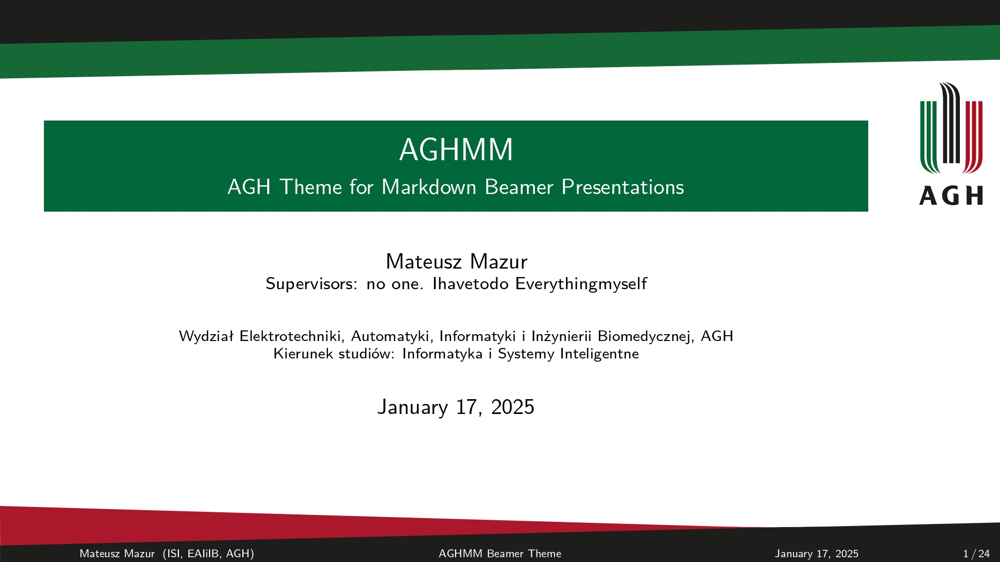

# AGHMD - AGH Theme for Markdown Beamer Presentations

**AGHMD** is a LaTeX Beamer theme designed to be used with the [Pandoc](https://pandoc.org/) document converter.

## Credits

Theme is based on:
- [AGH Presentation Template 1](https://www.agh.edu.pl/en/university/multimedia/presentation-templates) (appearance)
- [AGH LaTeX Beamer template 2](https://www.agh.edu.pl/en/university/multimedia/presentation-templates) (structure)
- [Boadilla Beamer Theme](https://github.com/josephwright/beamer/blob/main/base/themes/theme/beamerthemeBoadilla.sty) (structure)

Bibliography style (in `csl` folder) was downloaded from [Zotero Style Repository](https://www.zotero.org/styles/).

## Supported features

The theme supports the following features:

- 16:9 aspect ratio
- Title page with metadata information (title, subtitle, author, date, institute)
- Slides with:
    - AGH logo
    - *infolines* theme footline (including title, author, institute and page number; supports short title and short institute)
- Sections, subsections titles (can be turned off using `section-titles: false`)
- Table of contents (specified in the `src/02-toc.md` file)
- pandoc-crossref (settings available in the `src/01-pandoc-crossref.md` file)
- Citations
- Multi-page bibliography (specified in the `src/99-bib.md` file)
- *Thank you* and *questions* slides (specified in `src/97-thank-you.md` and `src/98-questions.md` files)
- Dynamic language switching (using `lang` metadata (`00-config.md`), e.g. `lang: pl-PL` for Polish).
  For custom elements (e.g. *toc*, *questions*, *thank you* and *bibliography* tiles), the translations are provided using the LUA script (`filters/lang-filter.lua`). You can add your own translations there.

Final PDF file presenting all the possibilities is saved in the `out` directory as `slides-latest.pdf`.

## Requirements

- [Pandoc](https://pandoc.org/) (tested with version 3.6)
- [pandoc-crossref](https://github.com/lierdakil/pandoc-crossref) (tested with version 3.6)
- [texlive-lang-polish](https://packages.debian.org/sid/tex/texlive-lang-polish) package for Polish language support (optional, for Polish language)
- [just](https://github.com/casey/just) (for running commands, optional but recommended)

## Usage

### Theme installation

To install the AGHMD theme, run the command `just install-aghmd`. This will copy the theme files to the appropriate directory.

### Presentation configuration

Slides configuration and metadata can be changed in a `src/00-config.md` file.

Markdown files should be placed in `src` directory. It is possible to use multiple markdown files in one presentation, 
they will be concatenated in the order of their names. As Pandoc concatenates files alphabetically, it is recommended to name the files with numbers at the beginning, e.g. `10-intro.md`, `20-theory.md`, `30-results.md`, etc.

The assets linked in the files also should be placed in the `src` directory and the paths should be relative to it.

### Presentation compilation

To compile the presentation, run the command `just pdf`. The output will be saved in the `out` directory as `slides-latest.pdf`. The source files folder, output folder and the output file name can be changed using the `src`, `outdir` and `out` variables in the `justfile`.
